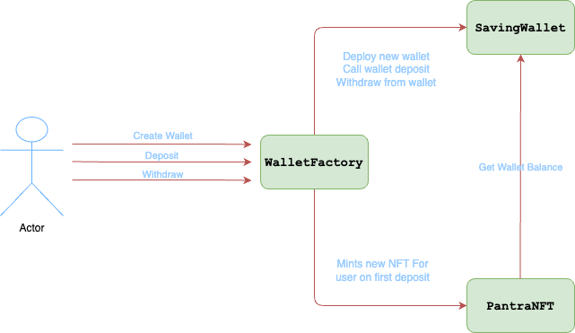

# Pantra Contracts

Pantra Contracts is a set of Lightlink smart contracts designed to provide users with a savings wallet that accumulates ETH on every transaction. These contracts powers the Pantra Smart Wallet mobile App. The contracts consists of three main components: `PantraSavingWallet`, `PantraWalletFactory`, and `PantraSmartWalletNFT`. The Enterprise mode has been enabled for the `PantraWalletFactory` and `PantraSmartWalletNFT` contracts to allow for gassless wallet creation and NFT minting.

## Contract Architecture



### 1. PantraSavingWallet

* `PantraSavingWallet` is the core contract responsible for storing ETH and managing user deposits and withdrawals.
* Users can reset withdrawal intervals `DAILY`, `WEEKLY`, or `MONTHLY`.
* Early withdrawals attracts a 1% fee.

### 2. PantraWalletFactory

- `PantraWalletFactory` is responsible for `PantraSavingWallet` creation for each user.
- Users interacts with the `PantraSavingWallet` contract through the `PantraWalletFactory`.
- [Pegasus Deployment](https://pegasus.lightlink.io/address/0x2e7678287a805d36465eda036b4590D2B29C6E57)

### 3. PantraSmartWalletNFT

- `PantraSmartWalletNFT` is an NFT (Non-Fungible Token) that gets minted by the `PantraWalletFactory` on the user's first deposit into the savings wallet.
- The NFT returns a `tokenURI` which contains an SVG representation of the user's wallet address and wallet balance from the associated `PantraSavingWallet`.
- [Pegasus Deployment](https://pegasus.lightlink.io/address/0x6a3215AA8De3511a0A336ccEC1Fdc46C4511d7c2)

## Deployment Addresses

### 1. PantraWalletFactory
   * Pegasus - [0x84A7BB3e3210F3F38eeF88615492f066917eCA37](https://pegasus.lightlink.io/address/0x84A7BB3e3210F3F38eeF88615492f066917eCA37)
   * Phoenix - Coming Soon

### 2. PantraWalletNFT
   * Pegasus - [0xF0c8355c1744532C1093f751847763191314992b](https://pegasus.lightlink.io/address/0xF0c8355c1744532C1093f751847763191314992b)
   * Phoenix - Coming Soon

## Development

### Prerequisites

- Node.js installed on your machine
- Hardhat installation [Link here](https://hardhat.org/hardhat-runner/docs/getting-started#installation)

### Installation

1. Clone the repository:

   ```bash
   git clone <repository-url>
   cd pantra-contracts
   ```

2. Install dependencies:

   ```bash
   npm install
   ```

### Testing

Run Hardhat Tests:

```bash
npx hardhat test
```

### Deployment

Deploy contracts to a network (e.g., Lightlink Phoenix, Lightlink Pegasus):
1. Create a .env file with the contents
```bash
PEGASUS_TESTNET_RPC_URL="https://replicator.pegasus.lightlink.io/rpc/v1"
PHEONIX_MAINNET_RPC_URL="https://replicator.phoenix.lightlink.io/rpc/v1"
PRIVATE_KEY=<PRIVATE_KEY OF THE CONTRACT DEPLOYER>
```
2. Lightlink Testnet deployment
```bash
npx hardhat run scripts/deploy.ts --network testnet
```

2. Lightlink Mainnet deployment
```bash
npx hardhat run scripts/deploy.ts --network mainnet
```

## License

This project is licensed under the MIT License - see the [LICENSE](LICENSE) file for details.
